# 🚀 部署工作流程指南
## Deployment Workflow Guide

**版本**: v1.3.0  
**更新日期**: 2025-09-03  
**適用範圍**: 開發/測試/生產環境分離策略  

---

## 📋 **多環境架構概述**

### **環境架構設計**:
```
├── 🖥️  Development (開發環境)
│   ├── 地址: http://localhost:3001  
│   ├── 分支: feature/* (本地開發)
│   ├── 用途: 本地開發和單元測試
│   └── 資料庫: 開發資料庫或本地資料庫
│
├── 🧪 Staging (測試環境)
│   ├── 地址: https://kcislk-infohub-staging.zeabur.app
│   ├── 分支: develop (自動部署)
│   ├── 用途: 整合測試和 UAT
│   └── 資料庫: 測試資料庫 (可共用生產)
│
└── 🌟 Production (生產環境)
    ├── 地址: https://kcislk-infohub.zeabur.app
    ├── 分支: main (自動部署)
    ├── 用途: 正式營運服務
    └── 資料庫: 生產資料庫
```

---

## 🔧 **環境配置策略**

### **1. 本地開發環境 (localhost:3001)**

**配置檔案**: `.env.development` (本地創建，不提交到 Git)

**特色**:
- 使用較寬鬆的安全設定
- 啟用詳細的除錯訊息
- 可連接開發資料庫或共用測試資料庫
- OAuth 重定向到 `http://localhost:3001`

**啟動方式**:
```bash
# 標準開發模式
npm run dev

# 或明確指定環境
npm run dev:development
```

### **2. Zeabur 測試環境 (Staging)**

**Zeabur 服務配置**:
- **服務名**: `landing-app-v2-staging`
- **綁定分支**: `develop`
- **自動部署**: 推送到 develop 觸發
- **域名**: `kcislk-infohub-staging.zeabur.app`

**環境變數** (在 Zeabur 控制台設定):
```env
NODE_ENV=staging
DATABASE_URL=[測試資料庫URL]
NEXTAUTH_URL=https://kcislk-infohub-staging.zeabur.app
NEXTAUTH_SECRET=[測試環境密鑰]
JWT_SECRET=[測試環境JWT密鑰]
GOOGLE_CLIENT_ID=[Google OAuth Client ID]
GOOGLE_CLIENT_SECRET=[Google OAuth Secret]
ALLOWED_ORIGINS=https://kcislk-infohub-staging.zeabur.app
ENABLE_TEST_FEATURES=true
SHOW_DEBUG_INFO=true
```

### **3. Zeabur 生產環境 (Production)**

**Zeabur 服務配置**:
- **服務名**: `landing-app-v2` (現有)
- **綁定分支**: `main`
- **自動部署**: 推送到 main 觸發
- **域名**: `kcislk-infohub.zeabur.app`

**環境變數** (在 Zeabur 控制台設定):
```env
NODE_ENV=production
DATABASE_URL=[生產資料庫URL]
NEXTAUTH_URL=https://kcislk-infohub.zeabur.app
NEXTAUTH_SECRET=[生產環境密鑰]
JWT_SECRET=[生產環境JWT密鑰]
GOOGLE_CLIENT_ID=[Google OAuth Client ID]
GOOGLE_CLIENT_SECRET=[Google OAuth Secret]
ALLOWED_ORIGINS=https://kcislk-infohub.zeabur.app
RATE_LIMIT_MAX_REQUESTS=100
RATE_LIMIT_WINDOW_MS=900000
PRISMA_CLI_TELEMETRY_DISABLED=1
```

---

## 🔄 **開發工作流程**

### **完整開發週期**:

```mermaid
graph LR
    A[本地開發] --> B[推送到 develop]
    B --> C[Staging 自動部署]
    C --> D[測試驗證]
    D --> E[創建 PR: develop → main]
    E --> F[代碼審核]
    F --> G[合併到 main]
    G --> H[Production 自動部署]
    H --> I[生產驗證]
```



### **Step 1: 本地開發**
```bash
# 1. 創建或切換到功能分支
git checkout develop
git pull origin develop
git checkout -b feature/your-feature-name

# 2. 啟動本地開發環境
npm run dev  # 在 http://localhost:3001

# 3. 開發並測試功能
# 4. 提交變更
git add .
git commit -m "feat: add your feature description"
```

### **Step 2: 推送到測試環境**
```bash
# 1. 推送功能分支並合併到 develop
git push origin feature/your-feature-name

# 2. 創建 PR: feature/your-feature-name → develop
# 3. 合併後，develop 分支會自動部署到 Staging
```

### **Step 3: 測試環境驗證**
```bash
# 訪問測試環境進行驗證
# https://kcislk-infohub-staging.zeabur.app

# 可選: 本地測試 staging 配置
npm run dev:staging  # 在 http://localhost:3002
```

### **Step 4: 生產環境發布**
```bash
# 1. 測試通過後，創建 PR: develop → main
# 2. 代碼審核
# 3. 合併到 main 觸發生產部署
# 4. 生產環境驗證
```

---

## 🛠️ **Zeabur 多服務設定指南**

### **步驟 1: 創建 Staging 服務**

1. **登入 Zeabur 控制台**
2. **創建新服務**:
   - 服務名稱: `landing-app-v2-staging`
   - 選擇相同的 GitHub 儲存庫
   - **重要**: 綁定到 `develop` 分支

3. **配置 Staging 環境變數**:
   - 複製生產環境變數
   - 修改 `NEXTAUTH_URL` 為測試域名
   - 修改其他環境特定設定

### **步驟 2: 域名配置**

**Staging 域名選項**:
- Option A: `kcislk-infohub-staging.zeabur.app`
- Option B: 使用 Zeabur 提供的預設域名
- Option C: 自訂測試子域名

**DNS 配置** (如使用自訂域名):
- 添加 CNAME 記錄指向 Zeabur

### **步驟 3: Google OAuth Console 更新**

**添加測試環境重定向 URI**:
1. 前往 Google Cloud Console
2. 找到 OAuth 2.0 Client ID
3. 在 "Authorized redirect URIs" 添加:
   ```
   https://kcislk-infohub-staging.zeabur.app/api/auth/callback/google
   ```

**完整重定向 URI 列表**:
```
http://localhost:3001/api/auth/callback/google          # 開發環境
https://kcislk-infohub-staging.zeabur.app/api/auth/callback/google  # 測試環境
https://kcislk-infohub.zeabur.app/api/auth/callback/google          # 生產環境
```

---

## 🧪 **測試策略**

### **開發環境測試**:
```bash
# 功能測試
npm run dev
npm run test

# 資料庫測試
npm run test:db

# OAuth 測試
npm run test:oauth-config
```

### **測試環境驗證**:
```bash
# API 健康檢查
curl https://kcislk-infohub-staging.zeabur.app/api/health

# OAuth 提供者檢查
curl https://kcislk-infohub-staging.zeabur.app/api/auth/providers

# 完整功能測試 (手動)
# - 訪問測試網站
# - 測試 Google 登入流程
# - 驗證所有主要功能
```

### **生產環境驗證**:
```bash
# 生產健康檢查
npm run verify:production

# 生產 OAuth 測試
npm run validate:oauth-production
```

---

## 📊 **環境對比表**

| 特性 | Development | Staging | Production |
|------|-------------|---------|------------|
| 域名 | localhost:3001 | staging.domain | kcislk-infohub.zeabur.app |
| 分支 | feature/* | develop | main |
| 部署 | 手動 | 自動 | 自動 |
| 資料庫 | 開發/測試 | 測試 | 生產 |
| 除錯 | 詳細 | 部分 | 關閉 |
| 監控 | 關閉 | 建議 | 必須 |
| 效能 | 寬鬆 | 中等 | 嚴格 |

---

## ⚡ **快速命令參考**

### **常用開發命令**:
```bash
# 環境切換
npm run dev              # 開發環境 (port 3001)
npm run dev:staging      # 本地測試 staging 配置 (port 3002)  
npm run dev:production   # 本地測試 production 配置 (port 3003)

# 建置命令
npm run build:staging    # Staging 建置
npm run build:production # Production 建置

# 資料庫命令
npm run deploy:dev       # 開發環境資料庫部署
npm run deploy:staging   # 測試環境資料庫部署  
npm run deploy:production # 生產環境資料庫部署
```

### **Git 工作流程快捷方式**:
```bash
# 快速功能開發
git checkout develop && git pull origin develop
git checkout -b feature/new-feature
# ... 開發 ...
git add . && git commit -m "feat: description"
git push origin feature/new-feature

# 快速發布到測試
git checkout develop
git merge feature/new-feature
git push origin develop  # 觸發 staging 部署

# 快速發布到生產 (通過 PR)
# 創建 PR: develop → main 在 GitHub
```

---

## 🔒 **安全考量**

### **環境隔離原則**:
- 測試環境可使用較寬鬆的設定進行功能驗證
- 生產環境必須使用最嚴格的安全配置
- 敏感資料絕不在環境間共用

### **資料庫策略**:
- **選項A**: 完全獨立的測試資料庫 (推薦)
- **選項B**: 共用資料庫，使用不同 schema
- **選項C**: 共用資料庫，謹慎標記測試資料

### **OAuth 安全**:
- 每個環境都有明確的重定向 URI 限制
- 測試環境可使用相同 OAuth App，但需要額外重定向 URI
- 生產環境 OAuth 設定經過完整驗證

---

## 🆘 **故障排除**

### **常見問題**:

**1. OAuth 重定向錯誤**:
```bash
# 檢查 Google Console 重定向 URI 配置
# 確保每個環境都有對應的重定向 URI
```

**2. 環境變數錯誤**:
```bash
# 檢查 Zeabur 控制台環境變數設定
# 確保 NEXTAUTH_URL 與實際域名匹配
```

**3. 資料庫連接問題**:
```bash
# 測試資料庫連接
npm run test:db

# 檢查資料庫 URL 格式
echo $DATABASE_URL
```

**4. 分支部署問題**:
```bash
# 確認 Zeabur 服務綁定正確分支
# 檢查 GitHub webhook 觸發狀態
```

---

## 📈 **監控與維護**

### **定期檢查項目**:
- [ ] 測試環境功能正常
- [ ] 生產環境效能穩定
- [ ] 所有環境的資料庫連接正常
- [ ] OAuth 登入流程在所有環境都正常
- [ ] 監控系統正常運作

### **維護週期**:
- **每週**: 檢查所有環境健康狀態
- **每月**: 更新依賴套件和安全補丁
- **每季**: 審查和更新環境配置
- **每年**: 更換生產環境機密密鑰

---

**🎯 這個多環境策略讓您可以安全地開發、測試和部署，同時保護生產環境的穩定性！**

---

*Generated by Claude Code - Multi-Environment Deployment Workflow | v1.3.0*