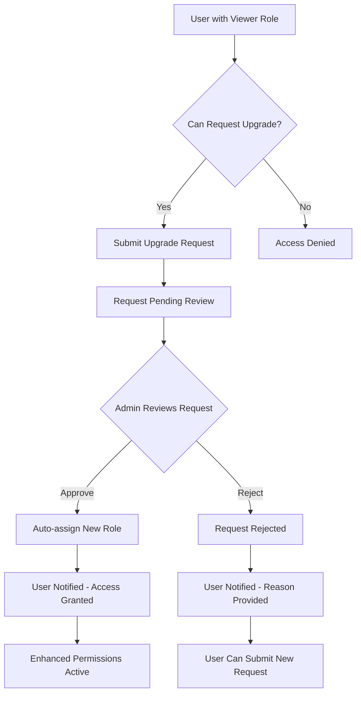

# Permission Upgrade System
# 權限升級系統

> **Document Version**: 1.0 | **文檔版本**: 1.0  
> **Last Updated**: 2025-08-23 | **最後更新**: 2025-08-23  
> **Status**: ✅ Production Ready | **狀態**: ✅ 生產就緒

## 🎯 Overview | 概述

The Permission Upgrade System enables users to request higher-level access permissions within the KCISLK ESID Info Hub, providing a streamlined workflow for role advancement with proper administrative oversight.

權限升級系統讓用戶能夠在 KCISLK ESID Info Hub 內請求更高級別的存取權限，提供角色提升的流暢工作流程並具備適當的管理監督。

## 🔄 Workflow Overview | 工作流程概述



## 🚀 Core Features | 核心功能

### 1. User Request Submission | 用戶請求提交
- **Self-service requests** for permission upgrades | **自助式請求** 權限升級
- **Reason requirement** to justify access needs | **原因要求** 證明存取需求
- **Duplicate prevention** for pending requests | **重複預防** 防止待審核請求

### 2. Admin Review Interface | 管理員審核介面
- **Centralized request management** | **集中式請求管理**
- **Detailed user information** for informed decisions | **詳細用戶資訊** 做明智決策
- **Bulk operations** for efficiency | **批量操作** 提高效率

### 3. Automatic Role Assignment | 自動角色分配
- **Instant role updates** upon approval | **批准時即時角色更新**
- **Database consistency** maintained | **維持資料庫一致性**
- **Audit trail preservation** | **保留審計軌跡**

## 🛠️ Technical Implementation | 技術實現

### Database Schema | 資料庫架構

```prisma
model PermissionUpgradeRequest {
  id              String    @id @default(cuid())
  userId          String    @map("user_id")
  requestedRole   String    @map("requested_role") @db.VarChar(50)
  reason          String
  status          String    @default("pending") @db.VarChar(20) // 'pending', 'approved', 'rejected'
  requestedBy     String    @map("requested_by")
  reviewedBy      String?   @map("reviewed_by")
  reviewNotes     String?   @map("review_notes")
  submittedAt     DateTime  @default(now()) @map("submitted_at")
  reviewedAt      DateTime? @map("reviewed_at")
  createdAt       DateTime  @default(now()) @map("created_at")
  updatedAt       DateTime  @updatedAt @map("updated_at")

  // Relations
  user              User  @relation("PermissionUpgradeUser", fields: [userId], references: [id], onDelete: Cascade)
  requestedByUser   User  @relation("PermissionUpgradeRequestedBy", fields: [requestedBy], references: [id])
  reviewedByUser    User? @relation("PermissionUpgradeReviewedBy", fields: [reviewedBy], references: [id])

  @@map("permission_upgrade_requests")
}
```

### API Endpoints | API 端點

#### User Endpoints | 用戶端點
```typescript
// Submit upgrade request
POST /api/admin/users/[id]/upgrade-request
{
  "requestedRole": "office_member",
  "reason": "Need to manage school events and resources"
}

// Get user's upgrade requests
GET /api/admin/users/[id]/upgrade-request
```

#### Admin Endpoints | 管理員端點
```typescript
// Get all upgrade requests (with pagination)
GET /api/admin/upgrade-requests?status=pending&page=1&limit=10

// Review upgrade request
POST /api/admin/upgrade-requests/[id]/review
{
  "decision": "approved", // or "rejected"
  "reviewNotes": "User demonstrates clear need for content management access"
}

// Get upgrade request details
GET /api/admin/upgrade-requests/[id]/review
```

### Frontend Components | 前端組件

#### User Request Form | 用戶請求表單
```typescript
interface UpgradeRequestForm {
  requestedRole: 'office_member' | 'admin'
  reason: string
  currentRole: string
  hasExistingRequest: boolean
}
```

#### Admin Review Interface | 管理員審核介面
```typescript
interface AdminReviewInterface {
  requests: PermissionUpgradeRequest[]
  filters: {
    status: 'pending' | 'approved' | 'rejected' | 'all'
    dateRange: DateRange
  }
  pagination: PaginationConfig
  bulkActions: BulkActionConfig[]
}
```

## 📋 Request Validation | 請求驗證

### Submission Rules | 提交規則
```typescript
const validationRules = {
  // Only valid role upgrades allowed
  allowedUpgrades: {
    'viewer': ['office_member', 'admin'],
    'office_member': ['admin'],
    'admin': [] // Cannot upgrade from admin
  },
  
  // Prevent duplicate requests
  duplicateCheck: 'BLOCK_IF_PENDING',
  
  // Required fields
  requiredFields: ['requestedRole', 'reason'],
  
  // Minimum reason length
  minReasonLength: 20
}
```

### Admin Review Rules | 管理員審核規則
```typescript
const reviewRules = {
  // Only admins can review requests
  reviewerRole: 'admin',
  
  // Required review decision
  requiredFields: ['decision'],
  
  // Optional review notes
  optionalFields: ['reviewNotes'],
  
  // Valid decisions
  validDecisions: ['approved', 'rejected']
}
```

## 🎨 User Experience | 用戶體驗

### Request Submission Flow | 請求提交流程
1. **User identifies need** for higher permissions | **用戶識別需求** 更高權限
2. **Access upgrade form** via admin dashboard | **存取升級表單** 透過管理儀表板
3. **Select desired role** and provide justification | **選擇期望角色** 並提供理由
4. **Submit request** with confirmation | **提交請求** 並確認
5. **Receive status updates** as request progresses | **接收狀態更新** 隨著請求進展

### Admin Review Flow | 管理員審核流程
1. **View pending requests** in centralized dashboard | **查看待審核請求** 在集中儀表板
2. **Review user details** and request justification | **審查用戶詳情** 和請求理由
3. **Make informed decision** with optional notes | **做明智決策** 附選擇性備註
4. **Approve or reject** with feedback | **批准或拒絕** 並提供反饋
5. **System automatically updates** user permissions | **系統自動更新** 用戶權限

## 🔐 Security Features | 安全功能

### Authentication & Authorization | 認證與授權
```typescript
const securityChecks = {
  // Request submission security
  submitRequest: {
    authentication: 'REQUIRED',
    selfOnlyOrAdmin: true,
    roleValidation: true
  },
  
  // Review security
  reviewRequest: {
    authentication: 'REQUIRED',
    adminRoleRequired: true,
    requestOwnership: 'VALIDATED'
  }
}
```

### Audit Trail | 審計軌跡
- **Complete request history** preserved | **完整請求歷史** 保留
- **Timestamps for all actions** | **所有操作的時間戳**
- **User and admin identities** logged | **用戶和管理員身份** 記錄
- **Decision reasoning** documented | **決策理由** 文檔化

## 📊 Status Management | 狀態管理

### Request States | 請求狀態
```typescript
enum RequestStatus {
  PENDING = 'pending',    // Awaiting admin review
  APPROVED = 'approved',  // Request approved, role assigned
  REJECTED = 'rejected'   // Request rejected with reason
}
```

### State Transitions | 狀態轉換
```typescript
const allowedTransitions = {
  'pending': ['approved', 'rejected'],
  'approved': [], // Final state
  'rejected': []  // Final state
}
```

## 🧪 Testing Scenarios | 測試場景

### Functional Tests | 功能測試
1. **Viewer requests office_member** role upgrade | **Viewer 請求 office_member** 角色升級
2. **Office_member requests admin** role upgrade | **Office_member 請求 admin** 角色升級
3. **Admin reviews and approves** upgrade request | **Admin 審核並批准** 升級請求
4. **Admin reviews and rejects** upgrade request | **Admin 審核並拒絕** 升級請求
5. **Duplicate request prevention** validation | **重複請求預防** 驗證

### Security Tests | 安全測試
1. **Unauthorized request submission** blocked | **未授權請求提交** 被阻止
2. **Non-admin review attempts** blocked | **非管理員審核嘗試** 被阻止
3. **Invalid role upgrade paths** rejected | **無效角色升級路徑** 被拒絕
4. **Request tampering** detection | **請求篡改** 檢測

### Performance Tests | 性能測試
1. **Large volume request handling** | **大量請求處理**
2. **Pagination efficiency** for admin interface | **分頁效率** 管理員介面
3. **Database query optimization** | **資料庫查詢優化**

## 📈 Analytics & Monitoring | 分析與監控

### Key Metrics | 關鍵指標
```typescript
const metrics = {
  requestVolume: 'Requests per day/week/month',
  approvalRate: 'Percentage of approved requests',
  processingTime: 'Average time from submission to decision',
  userSatisfaction: 'Post-upgrade user feedback',
  systemLoad: 'Database and API performance impact'
}
```

### Dashboard Views | 儀表板視圖
- **Request statistics** by role and time period | **請求統計** 按角色和時間段
- **Admin efficiency** metrics | **管理員效率** 指標
- **System performance** tracking | **系統性能** 追蹤

## 🚨 Error Handling | 錯誤處理

### Common Error Scenarios | 常見錯誤場景
```typescript
const errorHandling = {
  duplicateRequest: 'User-friendly message with existing request status',
  invalidRole: 'Clear explanation of valid upgrade paths',
  insufficientPermissions: 'Redirect to appropriate access level',
  systemError: 'Graceful fallback with retry options',
  timeoutError: 'Status preservation with continuation options'
}
```

## 🔧 Configuration | 配置

### Upgrade Rules Configuration | 升級規則配置
```typescript
const upgradeConfig = {
  // Valid role transitions
  roleHierarchy: ['viewer', 'office_member', 'admin'],
  
  // Auto-approval rules (if desired)
  autoApproval: {
    enabled: false,
    criteria: {} // Could include domain-based rules
  },
  
  // Notification settings
  notifications: {
    requestSubmitted: true,
    requestReviewed: true,
    roleAssigned: true
  }
}
```

---

**Implementation Status**: ✅ Complete and Production Ready | **實現狀態**: ✅ 完成且生產就緒  
**Integration**: Fully integrated with three-tier permission system | **整合**: 完全整合三層權限系統  
**Next Steps**: Performance monitoring and user feedback collection | **下一步**: 性能監控和用戶反饋收集